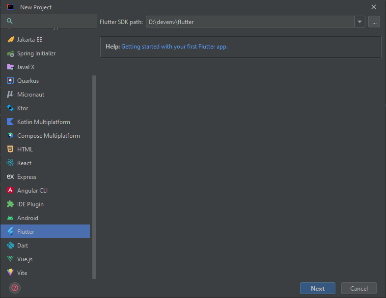
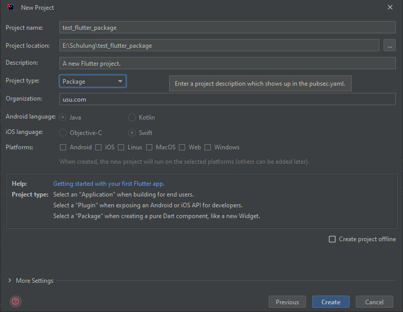
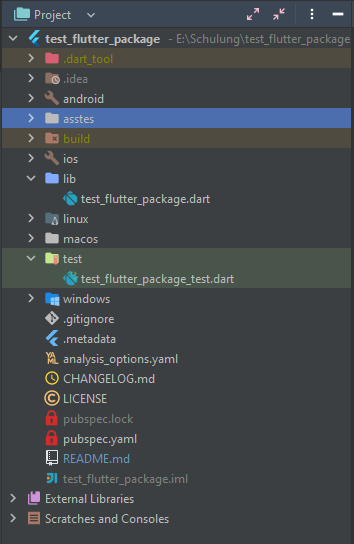
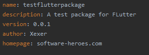
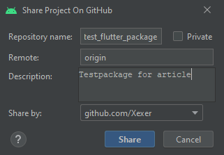
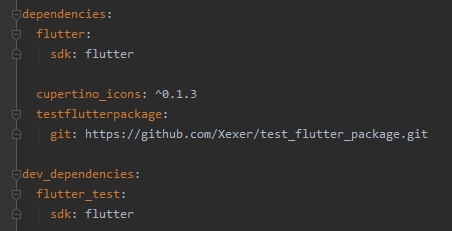

<!--
This README describes the package. If you publish this package to pub.dev,
this README's contents appear on the landing page for your package.

For information about how to write a good package README, see the guide for
[writing package pages](https://dart.dev/guides/libraries/writing-package-pages).

For general information about developing packages, see the Dart guide for
[creating packages](https://dart.dev/guides/libraries/create-library-packages)
and the Flutter guide for
[developing packages and plugins](https://flutter.dev/developing-packages).
-->

Quelle: https://software-heroes.com/blog/flutter-eigene-pakete-entwickeln-teil-1

# Flutter - Eigene Pakete entwickeln
In diesem Artikel geht es um die Entwicklung eines eigenen Pakets in Flutter und die Verwendung in eigenen Projekten, damit du nicht immer Code kopieren musst.

In einem unserer aktuellen Projekte hatten wir das Problem, dass wir von Projekt zu Projekt immer einige Komponenten wiederverwendet haben, den Code dazu aber 
manuell kopiert hatten. Dies erzeugte das Problem, dass Änderungen und Bugfixes manuell nachgezogen werden mussten.

Aus diesem Grund haben wir uns einmal die Paketentwicklung in Flutter angeschaut, um diese Komponenten zentral zur Verfügung zu stellen und nur an einer Stelle
zu Warten und zu pflegen.

## Wiederverwendung

Für unsere Apps verwenden wir einige zentrale Komponenten, die wir in jedem Projekt wiederverwenden können, um so ein ähnliches Look and Feel zur Verfügung zu 
stellen. Ebenso reduziert es die Entwicklungszeit neuer Apps. Typische Komponenten wären da:

- Login und Register-Bild
- Übersetzungen
- Allgemeines Fehlerhandling
- Provider-Objekte
- Routing
- Datenhaltung
- Grunddesign (Farben, Schriftart, Größen und Formen)

Beim Kopieren auf verschiedene Projekte, kann es dann zu unterschiedlichen Anpassungen oder Fehlerbehebungen kommen. Hier wäre dann der richtige Zeitpunkt, die 
Komponenten in ein eigenes Paket auszulagern.

## Anlage des Paket

In diesem Fall legen wir ein **neues Paket** an, um unsere Komponenten auslagern zu können. Unsere Besipiele beziehen sich daher auf Intellij Community, da wir
mit dieser Anwendung bisher die besten Erfahrungen gemacht haben und man alles für die App Entwicklung zur Verfügung gestellt bekommt.

Über "File -> New -> New Flutter Project ..." legen wir ein **neues Flutter Paket** an. Es erhält für unseren Test den Namen "test_flutter_package".

Die generierte Bibliothek erhält den Namen "testflutterpackage" und im lib Verzeichnis befindet sich die Datei mit dem gleichen Namen. Diese ist der 
Ausgangspunkt des Pakets für die Bereitstellung. Für den Test legen wir noch zusätzliche Objekte an, die wir bereitstellen wollen.

Wenn du für deine Entwicklung noch weitere externe Pakete benötigst, kannst du diese wie gewohnt über die pubspec.yaml Datei einbinden und laden. Hier verhält 
sich das Paket wie eine normale Flutter App, wenn du entwickelst. Weiterhin können noch einige zusätzliche Informationen hinterlegt werden.

## Git

Die Bereitstellung des Pakets kann lokal passieren oder über Git. Da wir unser Paket auch gleichzeitig sichern wollen, werden wir es im nächsten Schritt auf 
Github hochladen. Dazu verwenden wir die integrierte Versionverwaltung von Android Studio. 

Über den Menüpunkt "VCS -> Import into Version Control -> Share Project on Github" laden wir das Paket hoch. Nach dem Hochladen wird auch gleich der Initale 
Commit durchgeführt und das Paket ist eingecheckt.

_Hinweis:_ Hier hast du auch die Möglichkeit das Paket auf Private zu stellen, wenn du es nur für deine Projekte verwenden willst und es nicht jeder sehen soll.
Wahrscheinlich musst du dich noch mit deinem Account anmelden, damit die Verknüpfung angelegt wird.

## Implementierung
Wir erstellen eine neue App und binden das erstellte Paket ein. Da es nicht direkt über pub.dev eingebunden werden kann, da wir es dort nicht veröffentlicht 
haben, müssen wir dies über einen abgewandelten Weg tun. Im Folgenden das Beispiel aus dem pubspec.yaml.

Nach der Ausführung von "pub get" wir das Paket vom Pfad heruntergeladen und in das Projekt eingebunden. Du findest die Dateien nun unter den externen
Bibliotheken (External Libraries) und kannst das Paket verwenden.

## Fazit
Die Entwicklung und Bereitstellung eines Pakets für Flutter ist nicht sehr schwer und mit unserer kleinen Anleitung solltest du auch in Zukunft kein Problem
mehr haben. In unserem nächsten Artikel zur Serie werden wir noch auf das Thema lokaler Test im Paket eingehen, damit du deine Komponenten auch leicht 
weiterentwickeln kannst.